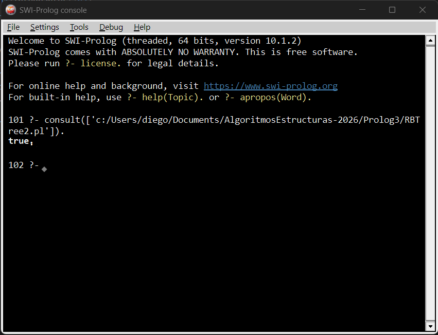
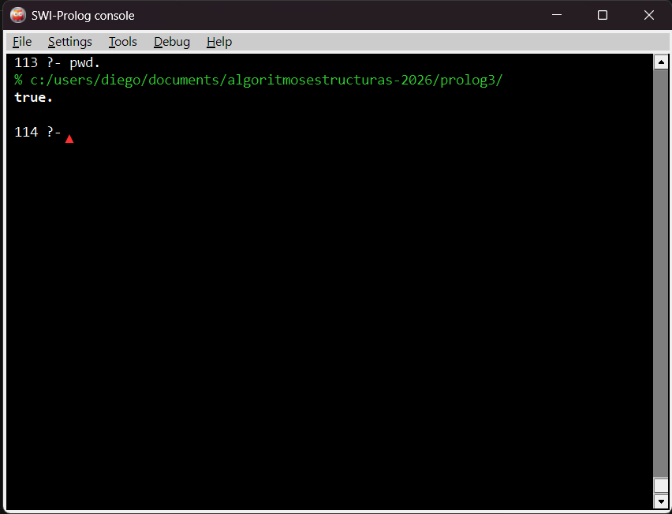
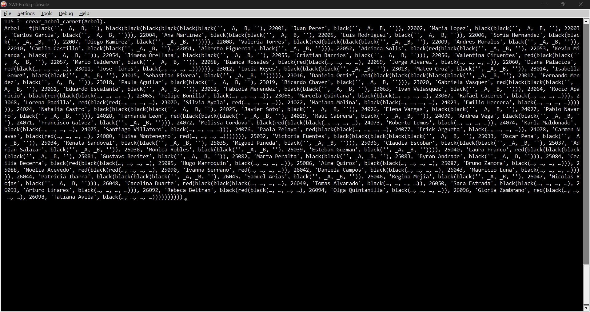
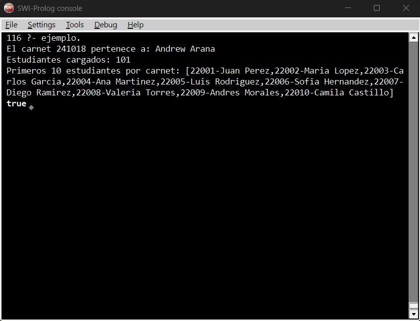

<h1 align="center">Entrega #3: Algoritmos y Estructuras de Datos</h1>
<h2 align="center">Lenguage de Programación: Prolog</h2>

<h3>Integrantes</h3>
<ul>
    <li>Andrew Alexander Arrivillaga Arana - 241018</li>
    <li>Diego André Chún Rizzo - 22955</li>
</ul>

<h3>Descripción General</h3>

El programa es una implementación de un Red-Black Tree en Prolog, utilizando 100 nombres de estudiantes con sus respectivos numeros de carnet como ejemplo. SWI-Prolog brinda una libreria "rbtrees" con metodos de inserción, eliminación y busqueda.

<h3>Screenshots del Funcionamiento</h3>

Consulta del archivo RBTree2.pl:

Ubicación del Archivo:

Creación del Red-Black Tree:

~~~
?- crear_arbol_carnet(Arbol).
~~~

Ejecución del Programa

~~~
?- ejemplo.
~~~

